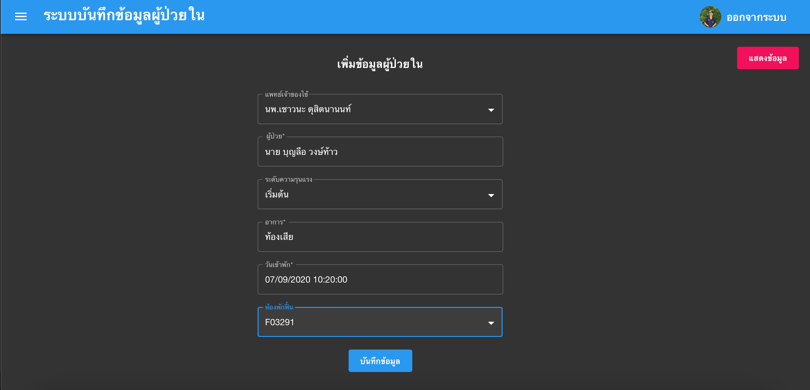
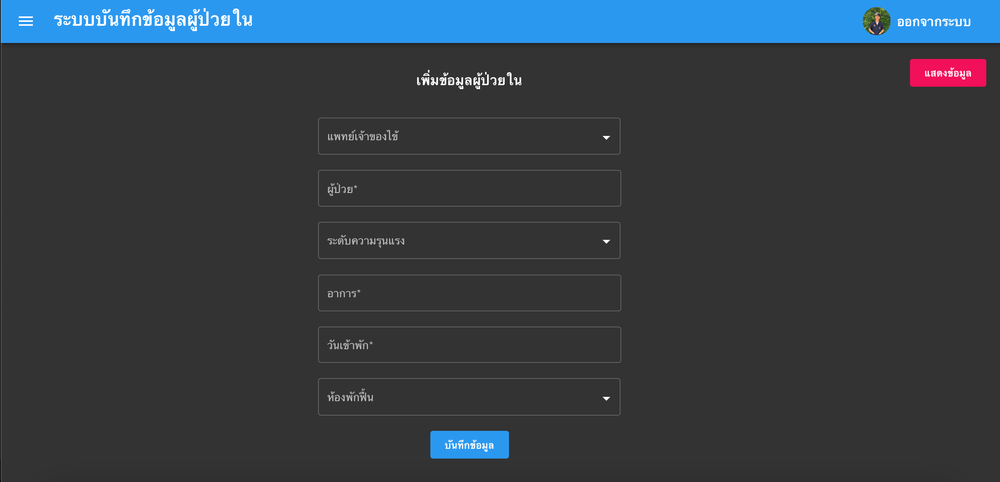
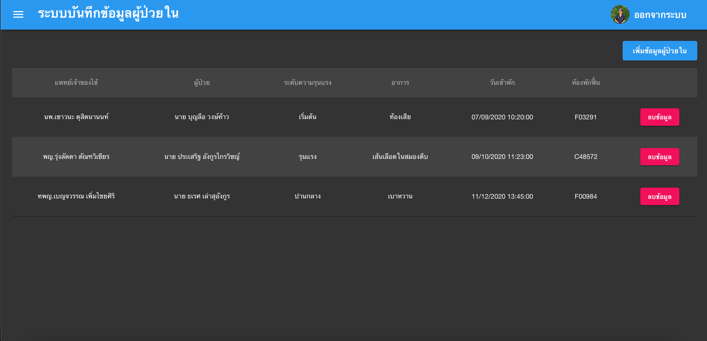

# ระบบบันทึกข้อมูลผู้ป่วยใน

### frontend using ReactJs
* `[node@12] $ npm install && $ yarn install`
* ` $ yarn start`

### [DB Browser for SQLite] SQLite3 Database && SQlite Browser on Ubuntu
* `sudo apt update`
* `sudo apt install sqlite3`
* `sudo apt install sqlitebrowser`

### backend using Go
* `[go build database] $ go build -o main.exe main.go`
* ` $ go run main.go`

### UX/UI - Test
* Login Page
  
</img>

* Add Page
  

  

* Table Page
  

